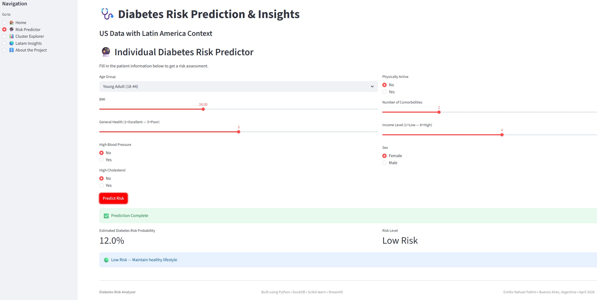
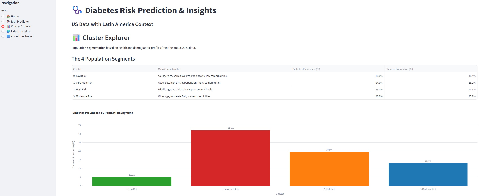

# Análisis de Riesgo de Diabetes e Insights de Salud Pública

**EE.UU. BRFSS 2023 • SQL • Clustering • Dashboard en Streamlit • Contexto Latinoamericano**

*Disponible en: 🇬🇧 English → [README.md](README.md) | 🇪🇸 Español (este archivo) | 🇮🇹 Italiano → [README.it.md](README.it.md)*

[]()
[](https://duckdb.org/)
[](https://streamlit.io/)


**Datos de EE.UU. con Contexto Latinoamericano**  
*Análisis BRFSS 2023 + Insights Regionales de IDF/OPS*

### 📋 Resumen del Proyecto

Este proyecto de portafolio analiza el riesgo de diabetes utilizando el dataset **Behavioral Risk Factor Surveillance System (BRFSS 2023)** (261,589 registros).

Incluye:
- Preparación de datos y feature engineering con **SQL** (DuckDB)
- Modelado de clasificación binaria para riesgo de diabetes
- Segmentación poblacional usando clustering K-Means
- Un **dashboard interactivo en Streamlit**
- Contexto regional y proyecciones al 2050 para Sudamérica y Centroamérica

---

### 🚀 Dashboard Interactivo y Reporte

- **Dashboard en Streamlit** (con predictor de riesgo interactivo):

    [🔗 Abrir Dashboard en Vivo](https://diabetes-risk-analysis-dashboard.streamlit.app/)  

- **Reporte HTML Interactivo**: 

    [Ver Reporte de Análisis de Riesgo de Diabetes (HTML)](https://emilionahuelpattini.com/es/data/data-analysis/projects/diabetes-report/diabetes-risk-analysis.html)  

- **Descargar Versión PDF** (lista para imprimir – Español): 

    [Descargar Reporte de Análisis de Riesgo de Diabetes – PDF](reports/Diabetes_Risk_Analysis-ES.pdf)

---

### 🛠️ Stack Tecnológico

- **Python** • **DuckDB** (Uso intensivo de SQL)
- **Pandas** • **Scikit-learn**
- **Plotly** • **Streamlit** (Dashboard Interactivo)
- **Clustering K-Means**

---

### 📊 Funcionalidades Clave

- **Foco en SQL**: Preparación de datos, limpieza e ingeniería de características extensiva usando DuckDB
- **Predictor de Riesgo Interactivo**: Estimación en tiempo real del riesgo de diabetes con un modelo de Regresión Logística entrenado
- **Segmentación Poblacional**: Clustering K-Means para identificar 4 grupos de riesgo distintos
- **Explicabilidad del Modelo**: Análisis de importancia de características e interpretación de clusters
- **Contexto Latinoamericano**: Integración de datos de IDF y OPS con proyecciones al 2050
- **Dashboard Profesional**: Aplicación Streamlit totalmente interactiva

---

### 📈 Principales Insights

- Edad, IMC, salud general e hipertensión son los predictores más fuertes del riesgo de diabetes
- Se identificaron cuatro segmentos poblacionales claros, con prevalencia de diabetes entre **10%** (Bajo Riesgo) y **64%** (Muy Alto Riesgo)
- La obesidad combinada con edad avanzada genera grupos de riesgo particularmente altos
- Se proyecta un aumento sustancial de casos de diabetes en Latinoamérica, de 35.4 millones en 2024 a 51.5 millones en 2050
- Gran oportunidad para programas de prevención dirigidos a clusters de alto riesgo

---

### 📁 Estructura del Proyecto

```
Diabetes_Risk_Analysis/
├── streamlit_app.py
├── Diabetes_Risk_Analysis-EN.ipynb
├── Diabetes_Risk_Analysis-ES.ipynb
├── Diabetes_Risk_Analysis-IT.ipynb
├── requirements.txt
├── environment/environment.yml
├── LICENSE
├── README.md
│
├── data/
│   ├── raw/
│   │   └── diabetes_012_health_indicators_BRFSS2023.csv     # Original raw file (25MB)
│   └── diabetes_model_ready.parquet
│
├── models/
│   ├── logistic_regression_model.pkl
│   └── model_columns.json
│
├── reports/                                   
│   ├── Diabetes_Risk_Analysis_Report_EN.pdf
│   ├── Diabetes_Risk_Analysis_Report_ES.pdf
│   └── Diabetes_Risk_Analysis_Report_IT.pdf
│
└── images/

```

---

### 🏃‍♂️ Cómo Explorar el Proyecto

#### 1. Abrir el Notebook Principal (Recomendado)

- Abre `Diabetes_Risk_Analysis-EN.ipynb` en **JupyterLab** o **VS Code**

- El notebook contiene el análisis completo end-to-end:
  - Preparación y limpieza de datos (con SQL)
  - Análisis Exploratorio de Datos
  - Ingeniería de características
  - Modelado y evaluación
  - Clustering
  - Conclusiones e insights

#### 2. Ejecutar el Dashboard Interactivo

También puedes explorar la aplicación web en vivo:

```bash
# Usando conda (recomendado)
conda env create -f environment.yml
conda activate diabetes_project
streamlit run app.py

# O usando pip
pip install -r requirements.txt
streamlit run app.py
```

---

### Capturas de Pantalla





---

### 👤 Contacto

- 📧 contact@emilionahuelpattini.com

- 💼 https://www.linkedin.com/in/emilionahuelpattini

- 🐙 https://github.com/ENPattini


¡Gracias por revisar este proyecto!  

No dudes en contactarme si tienes preguntas o sugerencias.

© Emilio Nahuel Pattini - Abril 2026 - Buenos Aires, Argentina

---

### 📄 Licencia

Este proyecto está licenciado bajo la MIT License - consulta el archivo [LICENSE](LICENSE) para más detalles.